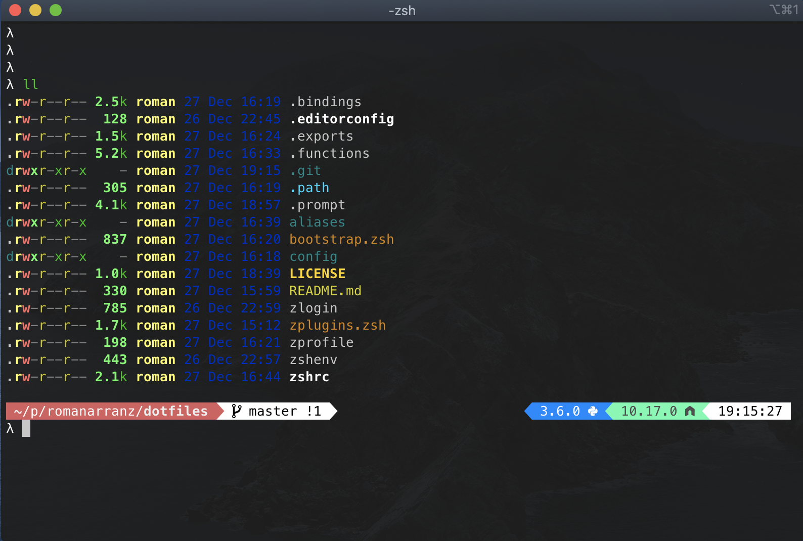

# Roman's dotfiles

The configurations are for my macOS workstation and therefore contain some macOS-specific code and commands.



## Quick Start

```
# get to the home folder
$ cd

# pull the git repos
$ git clone https://github.com/romanarranz/dotfiles.git .zsh-config

# then link the startup files
$ zsh ~/.zsh-config/bootstrap.zsh

# add gitconfig options
cat config/.gitconfig >> ~/.gitconfig
```

## Programming languages setup

Python dual setup for version 2 and 3

```
pyenv global 3.9.4 2.7.18
```

## Credits

- https://github.com/mathiasbynens/dotfiles
- https://github.com/htr3n/zsh-config
- https://github.com/broucz/dotfiles
- https://github.com/thoughtbot/dotfiles